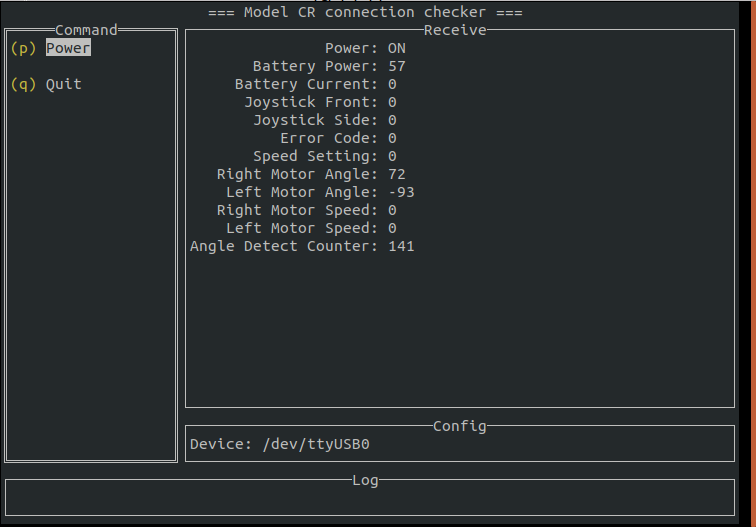

# cr_connection_checker

## 実行方法

本チェッカーはTUI : Terminal上で動作するアプリケーションです



Terminal上で実行ファイルを実行して使用してください


### Linux
ターミナル上でバイナリファイルを実行する
```
$ ./cr_connection_checker
```

### Windows

実行ファイルを拡張子.exeに変更する

Powershell上では拡張子.exeがないと実行ファイルと判断されないが、github上にexeファイルが含まれるとBrowserによってはウイルスとして認識され、ファイルがダウンロードできないため、ダウンロード後に拡張子を書き換えている

batファイルを実行してファイル名を変更する

```
$ ./rename_file.bat
```

Power shell上でバイナリファイルを実行する
```
$ ./cr_connection_checker.exe
```

### Device名の設定
PCにシリアル接続されたModel CRのデバイス名をdevice.jsonに設定する
defaultは"/dev/ttyUSB0"となっているので適宜変更すること

```
{
    "Device": "/dev/ttyUSB0"
}
```

#### Linuxの場合
主に"/dev/ttyUSB0", "/dev/ttyUSB1"などで検出されるがOSによって異なる
ケーブル接続時に追加されたデバイス名を`ls /dev/tty*"などで判断できる

#### Windowsの場合
主に"COM1", "COM2"などで検出される
ケーブル接続時に追加されたデバイス名をデバイスマネージャーなどで判断できる

```
{
    "Device": "COM1"
}
```

### 操作方法

接続がされている状態で"Receive"欄に機体から受信した情報が更新される
機体が電源ONの状態でBattery Poewerなどが表示されていれば正常に通信できている


"Command"欄の操作

p : 機体の電源ON/OFF
q : アプリの終了


